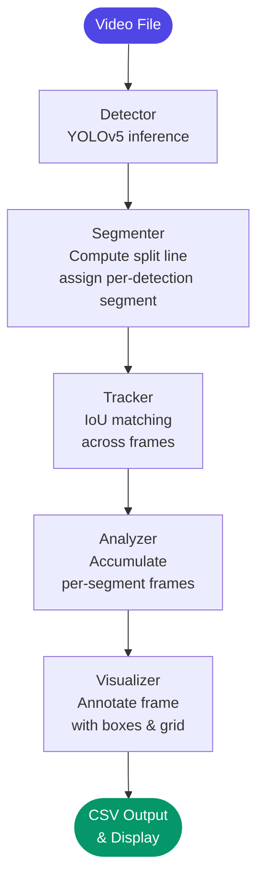

# ZoneWatch

> **One-liner:** A modular computer vision pipeline that detects people in video, segments the frame by visual content distribution, tracks identities across frames, and outputs per-segment dwell-time metrics to CSV.

---

## 📌 Table of Contents

- [The Problem](#-the-problem)
- [Our Solution & Purpose](#-our-solution--purpose)
- [Tech Stack](#-tech-stack)
- [System Flow](#-system-flow)
- [File Structure](#-file-structure)
- [Prerequisites](#-prerequisites)
- [Installation & Setup](#-installation--setup)
- [Usage](#-usage)
- [Configuration](#-configuration)
- [Screenshots](#-screenshots)
- [Contribution Guidelines](#-contribution-guidelines)
- [Known Limitations & Roadmap](#-known-limitations--roadmap)
- [License](#-license)

---

## 🚨 The Problem

Video-based spatial analysis often relies on static grid overlays that ignore the actual visual layout of a room. Meanwhile, person "tracking" is commonly implemented with naive per-frame hashing — creating a new identity for every detection in every frame — which makes dwell-time metrics unreliable or meaningless.

**Key pain points:**
- Static grids split the frame geometrically regardless of where the actual activity or room features are.
- Single-frame identity hashing inflates person counts and corrupts duration calculations.
- Monolithic scripts conflate detection, tracking, segmentation, and analysis, making them hard to debug, test, or extend.

---

## 🎯 Our Solution & Purpose

**ZoneWatch** is an extensible Python pipeline that detects people in video, divides the frame into area-weighted segments (based on pixel intensity or geometric rules), tracks each person's identity across frames via IoU overlap matching, and exports structured per-segment dwell-time data to CSV.

It solves the above by:
1. **Modular pipeline stages** — Each stage (detect, track, segment, analyze, visualize) is an independent, testable module with typed interfaces.
2. **Intensity-weighted segmentation** — The frame is split based on cumulative pixel intensity (or geometric rules), so segment boundaries reflect visual content rather than a fixed center line.
3. **Persistent identity tracking** — IoU-based matching assigns stable IDs across frames, enabling accurate per-person and per-segment duration measurement.

---

## 🛠 Tech Stack

| Technology | Version | Purpose |
|---|---|---|
| Python | 3.9+ | Runtime |
| PyTorch | ≥1.12 | Model inference engine |
| YOLOv5s | small | Object detection (person class) |
| OpenCV | ≥4.6 | Video I/O, image processing, visualization |
| NumPy | ≥1.21 | Array operations |

---

## 🔄 System Flow



| Step | Description |
|---|---|
| **Detector** | YOLOv5s processes each frame. Detections filtered by confidence (default ≥0.5) and class (default: person only). |
| **Segmenter** | Computes one or more vertical split lines using either `intensity_weighted` (cumulative pixel intensity) or `geometric` (equal-width) method. Each detection is assigned a segment label based on its bounding-box center relative to the splits. |
| **Tracker** | Matches current-frame detections to existing tracks by maximum IoU. Spawns new tracks for unmatched detections; marks tracks as missed when no match is found; evicts tracks after `max_missed_frames` consecutive absences. |
| **Analyzer** | Per frame, for each active track, increments a per-segment frame counter. Produces per-segment total seconds and per-person segment frame counts. |
| **Visualizer** | Draws bounding boxes, segment labels, and ROI polygon on the frame. Optionally writes annotated video to disk. |
| **Output** | CSV with columns: `segment`, `detection_frames`, `detection_seconds`, `room_area_px`. Summary printed to stdout. |

---

## 📁 File Structure

```
project-root/
│
├── src/                            # Application source code
│   ├── __init__.py
│   ├── types.py                    # Shared dataclasses (Detection)
│   ├── config.py                   # Config dataclass, JSON loading
│   ├── detector.py                 # YOLOv5 model wrapper
│   ├── tracker.py                  # IoU-based identity tracker
│   ├── segmenter.py                # Area-weighted frame segmenter
│   ├── analyzer.py                 # Per-segment metric accumulator
│   ├── visualizer.py               # OpenCV drawing utilities
│   └── main.py                     # CLI entry point, pipeline orchestration
│
├── data/
│   └── configs/
│       └── default.json            # Default configuration
│
├── tests/                          # Unit tests
│   ├── __init__.py
│   ├── test_segmenter.py           # 7 tests (split, assign, edge cases)
│   └── test_tracker.py             # 5 tests (match, miss, eviction, segment carry)
│
├── output/                         # Generated CSV results, annotated video
├── .gitignore
├── requirements.txt
├── LICENSE
└── README.md
```

---

## 🧰 Prerequisites

| Requirement | Minimum Version | Check Command |
|---|---|---|
| Python | 3.9 | `python --version` |
| pip | 21.x | `pip --version` |
| Git | 2.x | `git --version` |

> ⚠️ **OS Compatibility:** Tested on macOS and Linux. Windows (WSL2) expected to work; native Windows CMD/PowerShell not tested.

---

## 🚀 Installation & Setup

### 1. Clone the Repository

```bash
git clone https://github.com/your-username/area-mapping-and-segmentation.git
cd area-mapping-and-segmentation
```

### 2. Install Dependencies

```bash
pip install -r requirements.txt
```

*PyTorch installation may vary by platform — see [pytorch.org](https://pytorch.org) for OS-specific commands.*

### 3. Place Video and Model

Ensure your input video and YOLOv5 weights are accessible:

```
3452304387-preview.mp4     # or your video file
yolov5s.pt                  # or your custom model weights
```

### 4. Verify the Setup

```bash
python -m pytest tests/
```

```
✅ 12 passed
```

---

## 💡 Usage

### Basic Run

```bash
python -m src.main --video 3452304387-preview.mp4
```

### Custom Configuration

```bash
python -m src.main --config data/configs/default.json --no-display
```

### Common Commands

| Command | Description |
|---|---|
| `python -m src.main --video <path>` | Run pipeline on video |
| `python -m src.main --config <path>` | Run with JSON config file |
| `python -m src.main --no-display` | Run headless (no GUI window) |
| `python -m src.main --method geometric` | Use geometric instead of intensity-weighted split |
| `python -m src.main --output-csv results.csv` | Write metrics to custom path |
| `python -m src.main --output-video out.mp4` | Save annotated video |
| `python -m pytest tests/` | Run all tests |

### Expected Output

```
Processed 300/300 frames
Results saved to output/metrics.csv
Room area: 120000 px²
  Segment 1: 12.50s (375 frames)
  Segment 2: 8.30s (249 frames)
  Unique persons tracked: 2
```

---

## ⚙️ Configuration

Configuration via JSON file. Fields override when also passed as CLI args.

| Field | Required | Default | Description |
|---|---|---|---|
| `video_path` | Yes | `3452304387-preview.mp4` | Path to input video |
| `model_path` | No | `yolov5s.pt` | Path to model weights (null for pretrained) |
| `confidence` | No | `0.5` | Detection confidence threshold |
| `target_classes` | No | `[0]` | COCO class IDs to detect (0 = person) |
| `grid_rows` | No | `1` | Grid rows (reserved for future use) |
| `grid_cols` | No | `2` | Number of segments |
| `segmentation_method` | No | `intensity_weighted` | `intensity_weighted` or `geometric` |
| `roi` | No | `[100, 100, 500, 400]` | ROI polygon vertices `[x1, y1, x2, y2, ...]` |
| `iou_threshold` | No | `0.3` | Minimum IoU for track match |
| `max_missed_frames` | No | `30` | Frames before a lost track is evicted |
| `output_csv` | No | `output/metrics.csv` | Path to output CSV |
| `output_video` | No | `""` | Path to save annotated video (empty = skip) |
| `display` | No | `true` | Show live preview window |

---

## 🎥 Demo

<video src="3452304387-preview.mp4" controls width="100%"></video>

---

## 🤝 Contribution Guidelines

We welcome contributions — bug fixes, features, docs, and tests.

### Getting Started

1. **Fork** the repository
2. **Create** a branch from `main`:
   ```bash
   git checkout -b feat/your-feature-name
   ```
3. **Make** changes with clear, atomic commits
4. **Push** to your fork and open a Pull Request

### Branch Naming

| Type | Pattern | Example |
|---|---|---|
| New feature | `feat/[short-description]` | `feat/multi-camera-support` |
| Bug fix | `fix/[short-description]` | `fix/iou-division-by-zero` |
| Documentation | `docs/[short-description]` | `docs/update-readme` |
| Refactor | `refactor/[short-description]` | `refactor/segmenter-api` |

### Commit Messages

Follow [Conventional Commits](https://www.conventionalcommits.org/):

```
feat(tracker): add Kalman filter prediction
fix(segmenter): handle zero-intensity frame
docs(readme): update installation steps
```

### Pull Request Checklist

- [ ] Code follows project style
- [ ] All tests pass (`python -m pytest tests/`)
- [ ] New functionality has tests
- [ ] Documentation updated if needed

---

## 🛤 Known Limitations & Roadmap

### Current Limitations

- ⚠️ **Single camera only** — No multi-view fusion or cross-camera tracking.
- ⚠️ **No appearance-based re-identification** — Lost-and-found tracks get a new ID (no ReID embedding).
- ⚠️ **ROI is static** — Defined once at startup; doesn't adapt to camera motion or zoom.
- ⚠️ **YOLOv5 dependency** — First run requires internet to download the YOLOv5 repo via torch.hub (subsequent runs use cache).

### Roadmap

| Status | Milestone | Target |
|:---:|---|---|
| ✅ Done | Modular pipeline with typed interfaces | v1.0 |
| ✅ Done | Intensity-weighted segmentation | v1.0 |
| ✅ Done | IoU-based cross-frame tracking | v1.0 |
| ✅ Done | CSV metrics export | v1.0 |
| 🔄 In Progress | Configurable ROI from CLI | v1.1 |
| 📋 Planned | ByteTrack or DeepSORT integration | v2.0 |
| 💡 Exploring | Real-time streaming input (RTSP/Webcam) | Future |

---

## 📄 License

This project is licensed under the **MIT License**. See the [LICENSE](./LICENSE) file for full details.

---

<div align="center">

Built with ❤️ by [M N Aditya](https://github.com/your-username)

[⭐ Star this repo](https://github.com/your-username/area-mapping-and-segmentation) · [🐛 Report a Bug](https://github.com/your-username/area-mapping-and-segmentation/issues) · [💡 Request a Feature](https://github.com/your-username/area-mapping-and-segmentation/issues)

</div>
